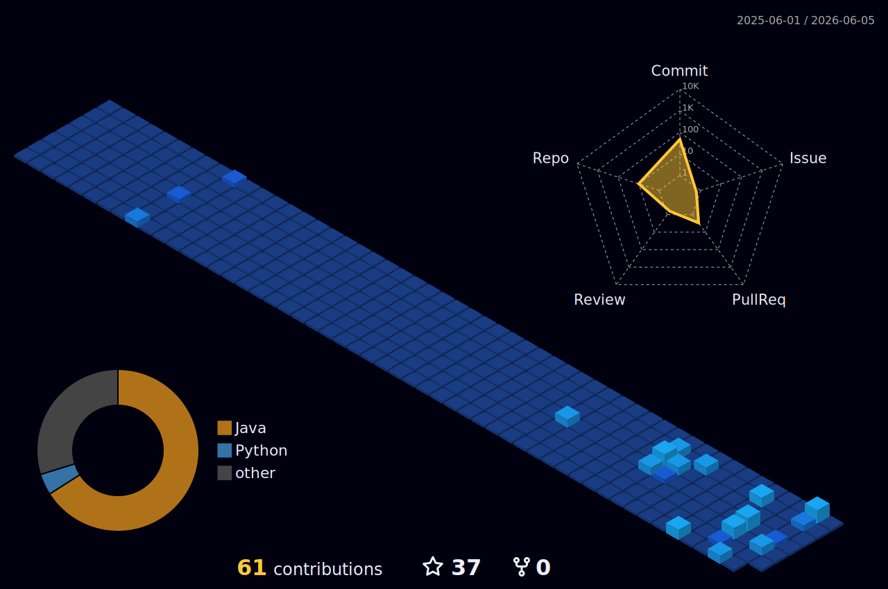

  <h1> 
     Guilherme Henrique de Oliveira Souza 🏅
    
 
       
        
    
    
  </h1>

  **_Engenheiro de Software e Analista de Dados & Business Intelligence_**
  
  São Paulo, SP - Brasil

  
  
  

    
  

## 🎯 Objetivo 
Atuar com Análise de dados e Tecnologia no mercado financeiro, unindo conhecimentos em **Compliance**, **_Prevenção à Lavagem de Dinheiro (PLD/FT)_**, _Produtos de investimentos e programação_ para gerar insights com inteligência estratégica para tomada decisões eficientes e assertivas.

## 🧠 Skills & Ferramentas 

- **Finanças e Investimentos**
    - Certificação PQO Backoffice ANBIMA
    - Renda fixa, Renda variável, Derivativos, Diversificação de carteira, Gestão de riscos
    - Conhecimento em produtos e processos bancários e do mercado de capitais
    - Indicadores operacionais e financeiros  
      
- **Compliance / PLD / Riscos**
    - Conhecimento de normas como Circular 3.978/20 do Bacen
    - Análise de transações e perfis de risco
    - Estruturação de políticas e manuais internos
    - Due Dilligence
    - KYC/ KYCC / KYB / KYP  

- **Dados e Programação**
   - `Python`, `SQL`, `AWS`, `VSCode`, ``
   - Automação de relatórios financeiros
   - Git/GitHub para versionamento
   - Dashboards com `Power BI`
   - Excel (PROCV, SE, Tabelas dinâmicas, macros, VBA)

## 📚 Formação Acadêmica 

**Bacharelado em Engenharia de Software** *(em andamento)*
Cruzeiro do Sul

**Técnico em ADS**
SENAI — São Paulo/SP  

**Técnico em Edificações**
SENAI — São Paulo/SP  

##  Interesses e Hobbies 🚀

- 🏎️ Carros, performance e projetos  
- 🏗️ Construção civil e design de interiores  
- 👨‍💻 Tech aplicada ao mercado financeiro  

---

> *“Nós **não sabemos tudo** e mais importante que saber tudo, é saber o **suficiente** para criar algo que transforme.”*
